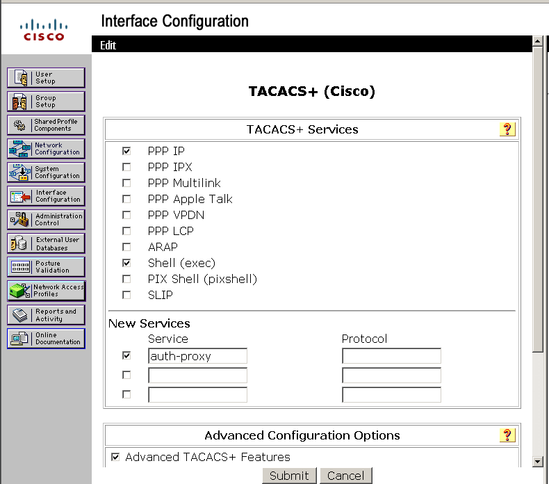
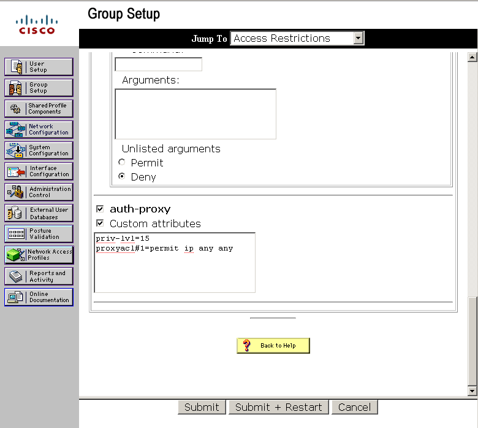

# Lab 4 — TACACS+ với GNS3, VirtualBox và VMware

## Mục lục

- [1. Import máy ảo Client](#1-import-máy-ảo-client)
- [2. Dựng topology trong GNS3](#2-dựng-topology-trong-gns3)
- [3. Cài đặt phần mềm trên Server](#3-cài-đặt-phần-mềm-trên-server)
- [4. Cấu hình Cisco Secure ACS](#4-cấu-hình-cisco-secure-acs)
- [5. Cấu hình AAA + Authentication Proxy trên TACACS_Client](#5-cấu-hình-aaa--authentication-proxy-trên-tacacs_client)
- [6. Mở rộng topology: Internet thật qua NIC thứ 2](#6-mở-rộng-topology-internet-thật-qua-nic-thứ-2)
- [7. Kiểm tra cuối cùng — test case đầy đủ](#7-kiểm-tra-cuối-cùng--test-case-đầy-đủ)
- [8. Lỗi thường gặp & cách xử lý](#8-lỗi-thường-gặp--cách-xử-lý)

## 1. Import máy ảo Client

1. Mở **VMware Workstation Pro**, chọn **File > Open** và trỏ đến file `XP Pro SP3.ova` (hoặc file OVA của Server 2003).
2. Chọn thư mục lưu trữ máy ảo và bấm **Import** (Nếu hiện cảnh báo OVF specification, chọn **Relax constraint**).
3. Chỉnh lại cấu hình phần cứng trước khi bật:
   - **Gán VMnet riêng biệt:**
     - Máy **XP Pro SP3** (Clients): Vào Settings > Network Adapter > Chọn **Custom** > Gán vào `VMnet2 (Host-only)`.
     - Máy **Server 2003** (TACACS_SERVER): Vào Settings > Network Adapter > Chọn **Custom** > Gán vào `VMnet3 (Host-only)`.
4. Bật máy ảo Win XP, đăng nhập user `Admin` (không mật khẩu).

## 2. Dựng topology trong GNS3

### 2.1. Thêm thiết bị vào topology

- Thêm một router làm `TACACS_Client`.
- Thêm 01 node Cloud, đổi tên thành `Clients` đại diện cho VM Win XP.
  - Click chuột phải `Clients` > **Configure** > Tab **Ethernet interfaces** > Chọn `VMware Network Adapter VMnet2` > Bấm **Add** > **Apply**.
- Thêm 01 node Cloud khác, đổi tên thành `TACACS_SERVER` đại diện cho VM Server 2003.
  - Click chuột phải `TACACS_SERVER` > **Configure** > Tab **Ethernet interfaces** > Chọn `VMware Network Adapter VMnet3` > Bấm **Add** > **Apply**.

> **Lưu ý quan trọng (rút ra từ thực tế triển khai):** GNS3 **không cho sửa interface của Cloud node khi nó đang có dây nối** (báo lỗi "Cannot modify a cloud that is already connected"). Nếu cần thêm/sửa VMnet cho một Cloud node đã có dây, phải **xóa dây trước**, cấu hình xong mới vẽ lại dây.

### 2.2. Nối dây theo sơ đồ thực tế đã dùng

| Thiết bị từ (`TACACS_Client`) | Cổng nối | Thiết bị tới (Node Cloud) | Cổng chọn trong Cloud |
| :--- | :--- | :--- | :--- |
| `TACACS_Client` | `f0/0` | `Clients` | `VMnet2` |
| `TACACS_Client` | `f0/1` | `TACACS_SERVER` | `VMnet3` |
| `TACACS_Client` | `f2/0` | `Internet` | `VMnet4` (xem mục 6) |

*Sau khi cắm dây, bấm **Start** tất cả thiết bị trên GNS3. Đảm bảo các chấm kết nối chuyển sang màu xanh.*

### 2.3. Gán IP cho router `TACACS_Client`

```text
configure terminal
interface FastEthernet0/0
 ip address 192.168.1.1 255.255.255.0
 no shutdown
exit

interface FastEthernet0/1
 ip address 10.0.0.1 255.255.255.0
 no shutdown
exit

interface FastEthernet2/0
 ip address 2.2.2.1 255.255.255.0
 no shutdown
exit
end
write memory
```

> ⚠️ Cả 3 interface đều **bắt buộc phải có `no shutdown`**. Thiếu dòng này (dù chỉ 1 interface) sẽ khiến `show ip route <mạng đó>` báo "% Network not in table" dù đã gán đúng IP — đây là lỗi thực tế đã gặp phải với `FastEthernet2/0` trong quá trình làm.

### 2.4. Gán IP tĩnh cho hai VM

Control Panel -> Network Connections -> Local Area Connection -> Properties -> Internet Protocol (TCP/IP)

| Máy | Địa chỉ IP | Subnet Mask | Gateway |
| --- | --- | --- | --- |
| VM XP (Clients) | `192.168.1.100/24` | `255.255.255.0` | `192.168.1.1` |
| VM Server 2003 (`TACACS_SERVER`) | `10.0.0.100/24` | `255.255.255.0` | `10.0.0.1` |

### 2.5. Kiểm tra kết nối cơ bản

- Từ VM XP, ping `192.168.1.1` (gateway), sau đó ping `10.0.0.100` (server). Cả hai lệnh phải thành công.
- Từ VM Server, ping `10.0.0.1` (gateway). Lệnh phải thành công.
- Trên router: `show ip interface brief` — mọi interface đang dùng phải ở trạng thái **up/up**, không phải `administratively down` hay `up/down`.

Nếu ping thành công theo cả hai chiều, topology đã sẵn sàng để cài ACS trên server và cấu hình AAA trên router.

## 3. Cài đặt phần mềm trên Server

### 3.1. Chuẩn bị và đưa file vào VM
- Đảm bảo Server 2003 đã cài **VMware Tools** (bắt buộc để kéo-thả hoạt động)
- Trong VM, tạo thư mục riêng: `C:\TACACS_Installers`
- Trên máy thật, chọn cả 3 file cùng lúc (giữ Ctrl + click): `jre-6u13-windows-i586-p-s.exe`, `ACSv4.2.124 FULL-K9.zip`, `Firefox Setup 2.0.exe` → kéo thả cả 3 vào thư mục vừa tạo trong VM
- Giải nén file ACS ngay trong VM: chuột phải vào file `.zip` → **Extract All...**

### 3.2. Cài Java Runtime
- Chạy `jre-6u13-windows-i586-p-s.exe`, Next/Install theo mặc định tới khi Finish

### 3.3. Cài Cisco Secure ACS
Chạy `setup.exe` trong thư mục vừa giải nén, làm theo từng bước:

1. **Important Notice** → **Next**
2. **Before You Begin** (4 checkbox điều kiện) → tick cả 4 ô → **Next**
3. **Internet Authentication Service Detected** → chọn **"Disable IAS (recommended)"** → **Next**
4. **Authentication Database Configuration** → giữ **"Check the ACS Internal Database only"** → **Next**
5. **Advanced Options** → giữ mặc định → **Next**
6. **Active Service Monitoring** → giữ **Enable Log-in Monitoring**, không tick Enable Mail Notifications → **Next**
7. **New Password / Confirm New Password** → mật khẩu mã hoá database nội bộ ACS (VD: `Cisco123!`)
8. Next tới khi cài xong → **Finish**

### 3.4. Cài Firefox 2.0
- Chạy `Firefox Setup 2.0.exe` → Standard → "Don't import anything" → Finish

### 3.5. Xác nhận ACS đã cài đặt thành công
- Mở Firefox, truy cập `https://127.0.0.1:2002` (dùng `127.0.0.1` thay vì `localhost`)
- Cổng thực tế ACS lắng nghe có thể khác `2002` tùy máy (thực tế đã gặp cổng `1065`) — nếu `2002` không vào được, kiểm tra icon ACS trên Desktop hoặc Start Menu để lấy đúng URL/cổng hiện tại.
- Chấp nhận cảnh báo SSL tự ký nếu có.
- Vào được trang chủ ACS (menu User Setup, Group Setup, Network Configuration...) → cài đặt thành công.

⚠️ Nếu không load được: kiểm tra **Services** — dịch vụ `CSAdmin` phải **Started**; nếu chưa, Start thủ công hoặc Restart VM.

## 4. Cấu hình Cisco Secure ACS

### 4.1. Khai báo AAA Client (Network Configuration)

1. Đăng nhập ACS → menu trái → **Network Configuration**.
2. Bảng **AAA Clients** → **Add Entry**.
3. Nhập:
   - **AAA Client Hostname**: `client` (hoặc `tacacs-client`, tùy đặt)
   - **AAA Client IP Address**: `10.0.0.1`
   - **Key** (shared secret): tự đặt, ví dụ `cisco123` — **phải khớp 100%** với key sẽ khai trên router ở mục 5
   - **Authenticate Using**: `TACACS+ (Cisco IOS)`
4. **Submit + Restart**.

> 📌 **Vì sao IP là `10.0.0.1` chứ không phải `192.168.1.x`?** Giá trị này phải là IP của interface trên router đang **đối diện trực tiếp với ACS Server** (tức router dùng IP này làm nguồn khi gửi gói TACACS+ sang ACS) — trong topology này chính là `FastEthernet0/1` (10.0.0.1), không phải interface phía Client. Cách xác minh chắc chắn: `show ip route 10.0.0.100` trên router, xem gói đi ra từ interface nào.
>
> Bảng **AAA Servers** ở dưới sẽ tự có sẵn 1 dòng tên `corp` với IP đúng bằng IP hiện tại của máy Server 2003 (`10.0.0.100`) — đây là ACS **tự đăng ký chính nó**, không cần chỉnh sửa gì thêm.

### 4.2. Tạo user test (User Setup)

1. Menu trái → **User Setup**.
2. Gõ tên user (ví dụ `nhanvien1`) vào ô tìm kiếm → **Add/Edit**.
3. Ở mục **Password Authentication**, chọn **ACS Internal Database**, nhập Password + Confirm Password.
4. **Submit**.

(Lặp lại để tạo thêm user thứ 2 nếu cần test trường hợp sai/đúng khác nhau.)

### 4.3. Interface Configuration

- Menu trái → **Interface Configuration** -> Thêm service auth-proxy -> Submit



### 4.4. Tạo group test (Group Setup)

- Menu trái → **Group Setup** → Kéo xuống cuối cùng → Tick vào `auth-proxy`, `custom attributes` → **Submit + Restart**

- Copy đoạn mã này vào ô **Custom Attributes**

```text
priv-lvl=15
proxyacl#1=permit ip any any
```



## 5. Cấu hình AAA + Authentication Proxy trên TACACS_Client

```text
configure terminal
!
aaa new-model
!
tacacs-server host 10.0.0.100 key cisco123
!
aaa authentication login default group tacacs+ local
aaa authorization auth-proxy default group tacacs+
!
ip auth-proxy name AUTHPROXY http
!
access-list 101 permit ip any any
!
interface FastEthernet0/0
 ip access-group 101 in
 ip auth-proxy AUTHPROXY
!
end
write memory
```

**Giải thích ý nghĩa từng phần:**
- `tacacs-server host 10.0.0.100 key cisco123`: chỉ định địa chỉ ACS Server và shared secret — key phải khớp đúng với key đã nhập ở mục 4.1.
- `ip auth-proxy name AUTHPROXY http`: khi client gửi HTTP request mà chưa xác thực, router sẽ chặn lại và hiện trang đăng nhập web (chính là trang bạn thấy khi truy cập `10.0.0.100`/`2.2.2.2` lúc chưa login).
- `ip auth-proxy AUTHPROXY` áp trên `FastEthernet0/0` (phía Clients): áp dụng cơ chế auth-proxy cho traffic đi ra từ mạng Client.
- `access-list 101 permit ip any any`: sau khi xác thực TACACS+ thành công, router tự động chèn permit cho IP nguồn đã xác thực — với ACL nền là "permit ip any any", client được phép đi tới **mọi đích** (cả `10.0.0.100` lẫn `2.2.2.0/24`), đúng yêu cầu đề bài không giới hạn chỉ 1 đích cụ thể.

**Kiểm tra:**
```text
show ip auth-proxy cache      ! xem session client đã xác thực
show access-lists 101         ! xem entry được chèn động sau khi login
```

## 6. Mở rộng topology: Internet thật qua NIC thứ 2

Do yêu cầu thực tế cần gõ được `2.2.2.2` và thấy phản hồi thật (không chỉ mang tính tượng trưng), bổ sung như sau — tận dụng lại chính VM Server 2003 đã có sẵn IIS, không cần dựng VM mới:

1. **VMware > Edit > Virtual Network Editor** → Change Settings → **Add Network...** → tạo **VMnet4**, kiểu Host-only, bỏ tích "Use local DHCP service".
2. Trong GNS3, thêm 1 Cloud node mới tên **Internet**. Chuột phải > Configure > tab Ethernet interfaces > chọn **VMware Network Adapter VMnet4** > Add > Apply.
   - ⚠️ Nếu Cloud node này **đã có dây nối từ trước** (ví dụ đã nối tạm vào `f2/0`), phải **xóa dây đó trước** mới Add được VMnet4 — nếu không sẽ báo lỗi "Cannot modify a cloud that is already connected", và dây cũ thực chất chưa hề trỏ đúng VMnet4.
3. Nối `f2/0` của router vào Cloud "Internet" (đúng cổng VMnet4 vừa thêm).
4. Tắt VM Server 2003 → VM > Settings > **Add...** > Network Adapter > Custom > **VMnet4** → bật lại VM.
5. Trong Windows, card mạng mới xuất hiện (thường tên **Local Area Connection 2/3**) → gán IP `2.2.2.2`, Subnet `255.255.255.0`, **để trống Default Gateway** (không cần khai vì máy chỉ cần 1 gateway duy nhất, đã có ở card đầu tiên `10.0.0.1`; nếu khai cả 2 gateway, Windows sẽ cảnh báo "Multiple default gateways").
6. IIS mặc định lắng nghe trên **All Unassigned** nên tự động phản hồi luôn trên `2.2.2.2` mà không cần cấu hình thêm gì trong IIS Manager.
7. Kiểm tra `show ip interface brief` trên router — `FastEthernet2/0` phải up/up, và `ping 2.2.2.2` từ router phải thành công trước khi test qua trình duyệt.


## 7. Kiểm tra cuối cùng — test case đầy đủ

Từ VM XP (Clients), thực hiện đủ các trường hợp sau để chứng minh hệ thống AAA hoạt động đúng:

| Trường hợp | Thao tác | Kết quả mong đợi |
|---|---|---|
| Chưa xác thực | `http://2.2.2.2` | Bị chặn, hiện trang đăng nhập của auth-proxy (không load được nội dung thật) |
| Xác thực sai | Nhập sai username/password ở trang login | Bị từ chối, không được cấp quyền |
| Xác thực đúng | Nhập đúng `nhanvien1` + password | Đăng nhập thành công, redirect tới trang đã yêu cầu ban đầu |
| Sau khi xác thực đúng | Truy cập `http://2.2.2.2` | Cũng load được trang IIS (Under Construction) — chứng minh được cấp quyền ra "Internet" thật |

## 8. Lỗi thường gặp & cách xử lý

| Lỗi | Nguyên nhân | Cách xử lý |
|---|---|---|
| `Could not find VMware vmrun` | GNS3 chưa biết đường dẫn `vmrun.exe` | Edit > Preferences > VMware, điền/Browse đúng path tới file `vmrun.exe` |
| `Attachment 'bridged'/'hostonly' is already configured...` | GNS3 chưa được cấp quyền tự đổi network adapter của VM | Preferences > VMware > VMware VMs > chọn template > tab Network > tick **"Allow GNS3 to override non custom VMware adapter"** |
| `a node without the linked clone setting enabled can only be used once` | Template VM chưa bật linked clone | Preferences > VMware VMs > template > tab General settings > tick **"Use as a linked base VM"** |
| `No VMnet interface available` | Chưa có VMnet tùy chỉnh nào tồn tại | VMware > Virtual Network Editor > Change Settings > Add Network... tạo thêm VMnet |
| GNS3 không thấy VMnet vừa tạo | GNS3 chỉ đọc danh sách adapter lúc khởi động | Đóng hẳn GNS3, mở lại; nếu vẫn không thấy, khởi động lại cả máy |
| `Cannot modify a cloud that is already connected` | Cloud node đang có dây nối, GNS3 khóa sửa interface | Xóa dây nối trước, cấu hình xong (Add VMnet) rồi vẽ lại dây |
| `show ip route <mạng>` báo "Network not in table" dù đã gán IP | Thiếu `no shutdown`, hoặc interface chưa thật sự up/up (line protocol down do VM/Cloud chưa bridge đúng) | `show ip interface brief` kiểm tra Status/Protocol; bổ sung `no shutdown`; kiểm tra VM đã Power On và Cloud bind đúng VMnet |
| Ping 1 chiều được, chiều ngược lại fail | Windows Firewall tự bật lại cho card mạng mới thêm | Network Connections > card đó > Properties > Advanced > bỏ tích Internet Connection Firewall |
| `Bad Request (Invalid Hostname)` khi truy cập trang login | Trình duyệt (Firefox/IE) đang cấu hình dùng proxy còn sót từ VM gốc | Tools > Options > tắt proxy (Firefox); hoặc Internet Options > LAN Settings > bỏ tích "Use a proxy server" (IE), vì Firefox có thể lấy theo cấu hình hệ thống của IE |
| Nhầm AAA Client IP theo bài bạn khác (VD: `192.168.1.2`) | Mỗi người thiết kế topology khác nhau, IP không có giá trị "chuẩn" chung | Luôn dùng đúng IP interface router **đối diện trực tiếp với ACS** của chính topology mình — xác minh bằng `show ip route <IP-server>` |