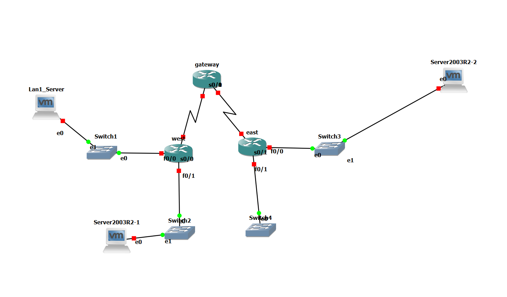

# Lab 5 — Triển khai chi tiết CBAC & Giải thích luồng hoạt động

---

# PHẦN A — TRIỂN KHAI

## A.1. Topology



## A.2. Chuẩn bị

### A.2.1. Thêm server vào LAN1

1. GNS3 → thêm node mới từ template Server2003R2 (đã bật *linked clone* từ Lab 3) → đặt tên `Server2003R2-3`.
2. Nối vào **Switch1**.
3. Start node, gán IP tĩnh trong VM:
   ```
   IP: 10.10.1.10
   Subnet mask: 255.255.255.0
   Gateway: 10.10.1.1
   ```
4. Cài IIS (Add/Remove Windows Components → Application Server → IIS) — chỉ cần tick **World Wide Web Service** (không cần FTP cho lab này).
5. Administrative Tools → IIS Manager → xác nhận **Default Web Site** đang **Start**.

### A.2.2. Thêm VTY cho Gateway (nếu Lab 3 chưa có)

```
Gateway#configure terminal
Gateway(config)#line vty 0 4
Gateway(config-line)#password cisco
Gateway(config-line)#login
Gateway(config-line)#end
Gateway#write memory
```

### A.2.3. Giữ nguyên toàn bộ Lab 3

Không sửa/xóa: topology, IP, RIPv2, ACL `ACL_LAN2_LAN3` trên West, Server LAN2/LAN3 hiện có.

## A.3. Nhiệm vụ 1 — Chặn lưu lượng từ bên ngoài

### Bước 1: Xác minh baseline (trước khi có ACL/CBAC)

Từ **Server2003R2-2** (LAN3, `10.10.3.100`):
```
ping 10.10.1.10
telnet 172.16.4.2
   (nhập password cisco, gõ exit để thoát)
```
Mở IE, truy cập `http://10.10.1.10` → trang IIS mặc định hiện ra, đóng trình duyệt.

Từ **Server2003R2-3** (LAN1, `10.10.1.10`):
```
ping 10.10.3.100
```

Tất cả các lệnh trên **phải thành công**. Nếu có lệnh fail ở đây, dừng lại xử lý routing/IP trước khi sang bước tiếp theo.

### Bước 2 — 3: Tạo và áp ACL chặn toàn bộ traffic từ ngoài

```
East#configure terminal
East(config)#ip access-list extended BLOCK_OUTSIDE
East(config-ext-nacl)#permit udp any host 224.0.0.9 eq rip
East(config-ext-nacl)#deny ip any any
East(config-ext-nacl)#exit
East(config)#interface Serial0/1
East(config-if)#ip access-group BLOCK_OUTSIDE in
East(config-if)#end
East#write memory
```

### Bước 4: Xác nhận bị chặn

Từ Server2003R2-2 (LAN3): `ping 10.10.1.10` → phải **fail** (khác kết quả Bước 1).

## A.4. Nhiệm vụ 2 — Tạo quy tắc kiểm tra CBAC

```
East#configure terminal
East(config)#service timestamps log datetime msec
East(config)#ip inspect name FWRULE icmp audit-trail on
East(config)#ip inspect name FWRULE telnet audit-trail on
East(config)#ip inspect name FWRULE http audit-trail on
East(config)#interface Serial0/1
East(config-if)#ip inspect FWRULE out
East(config-if)#end
East#write memory
```

### Kiểm tra lại sau khi có CBAC

- LAN3 → LAN1: `ping`, Telnet, HTTP — **tất cả phải thành công trở lại**.
  - Lưu ý: bản thân IIS Server 2003 (LAN1) sẽ **từ chối phiên Telnet** ở tầng ứng dụng (Windows Server 2003 không có Telnet Server bật mặc định) — đây là hành vi bình thường, không phải lỗi CBAC.
- LAN1 → LAN3: `ping`, Telnet — **vẫn phải bị chặn**.

## A.5. Nhiệm vụ 3 — Xác minh (chạy song song với phiên đang mở)

```
East#show ip inspect sessions
East#show ip inspect interfaces
```

## A.6. Nhiệm vụ 4 — Xem cấu hình

```
East#show ip inspect config
East#debug ip inspect detailed
   ... (quan sát vài giây) ...
East#undebug all
```

---

# PHẦN B — LUỒNG HOẠT ĐỘNG CỦA GÓI TIN

## B.1. Trạng thái trước khi có ACL (baseline)

Không có gì chặn — gói tin đi thẳng theo bảng định tuyến RIP hai chiều, IOS chỉ thực hiện routing, không kiểm tra nội dung/hướng phiên.

## B.2. Sau khi có ACL `BLOCK_OUTSIDE` (Nhiệm vụ 1) — vì sao bị chặn

ACL được áp **inbound trên Serial0/1 của East**. Nghĩa là: **mọi gói tin đi vào East từ hướng Gateway** (tức là từ mạng ngoài — West, LAN1, LAN2, hoặc chính Gateway) đều bị kiểm tra **ngay khi vừa đến cổng Serial0/1**, **trước khi** IOS kịp ra quyết định định tuyến (routing decision).

```
LAN1 Server (10.10.1.10)
      |
      v  gói ICMP Echo Request tới 10.10.3.100
    West
      |
      v
  Gateway
      |
      v  đến Serial0/1 của East
   ┌─────────────────────────────┐
   │  ACL BLOCK_OUTSIDE (inbound) │ ← kiểm tra tại đây
   │  permit RIP multicast? Không │
   │  deny ip any any → KHỚP      │
   └─────────────────────────────┘
      X   <-- gói bị DROP ngay tại đây, không tới được F0/0/LAN3
```

→ **Vị trí chính xác gói tin bị chặn: hàng đợi inbound của Serial0/1 trên East**, trước khi packet được chuyển tiếp (forward) sang F0/0 để tới LAN3. Router không hề gửi thông báo lỗi gì về cho người gửi (silent drop theo hành vi mặc định của ACL `deny`).

## B.3. Sau khi có CBAC (Nhiệm vụ 2) — cơ chế "mở cửa tạm thời"

CBAC không thay thế ACL `BLOCK_OUTSIDE` — ACL đó **vẫn tồn tại nguyên vẹn, vẫn deny mọi thứ theo mặc định**. CBAC hoạt động bằng cách **tự động chèn thêm 1 dòng permit tạm thời (dynamic ACL entry)** vào đúng ACL đó, chỉ khi có phiên hợp lệ được khởi tạo từ bên trong đi ra.

### Ví dụ cụ thể: LAN3 Server mở trình duyệt tới `http://10.10.1.10`

```
Bước 1 — Gói SYN (HTTP) rời khỏi LAN3:
   Server2003R2-2 (10.10.3.100:1050) ---SYN---> East F0/0 (inside)

Bước 2 — CBAC kiểm tra tại F0/0 (do "ip inspect FWRULE out" áp trên S0/1,
          nhưng CBAC quan sát traffic đi ra tại điểm interface trong):
   Gói khớp rule "http" trong FWRULE → CBAC bắt đầu theo dõi phiên này.

Bước 3 — CBAC ghi vào bảng trạng thái (state table):
   Session: src=10.10.3.100:1050  dst=10.10.1.10:80  protocol=TCP/HTTP

Bước 4 — CBAC tự động chèn 1 dòng permit TẠM THỜI vào đầu ACL
          BLOCK_OUTSIDE (inbound trên Serial0/1):
   permit tcp host 10.10.1.10 eq 80 host 10.10.3.100 eq 1050
   (chỉ cho phép ĐÚNG gói phản hồi của phiên này, không mở toang)

Bước 5 — Gói SYN tiếp tục đi: East -> Gateway -> West -> LAN1 Server (10.10.1.10)
          LAN1 Server trả lời SYN-ACK, rồi dữ liệu HTTP (port 80 -> 1050)

Bước 6 — Gói phản hồi từ 10.10.1.10:80 đến Serial0/1 của East (inbound):
   ┌───────────────────────────────────────────┐
   │ ACL BLOCK_OUTSIDE (đã có dòng dynamic mới) │
   │ permit tcp 10.10.1.10:80 -> 10.10.3.100:1050 → KHỚP → CHO QUA │
   └───────────────────────────────────────────┘
   Gói tiếp tục đi qua F0/0 -> tới LAN3 Server, trình duyệt hiện trang web.

Bước 7 — Khi phiên kết thúc (đóng trình duyệt / hết timeout):
   CBAC tự xóa cả session trong state table LẪN dòng dynamic ACL vừa thêm.
   ACL BLOCK_OUTSIDE quay lại đúng trạng thái ban đầu — deny mặc định.
```

**Điểm mấu chốt cần nhớ để trả lời:** CBAC không "mở toang" cổng — nó chỉ mở đúng 1 lỗ hổng khớp chính xác cặp IP:port của phiên đang chạy, và tự đóng lại ngay khi phiên kết thúc. Đây là lý do gọi là tường lửa **có trạng thái (stateful)**, khác hẳn ACL tĩnh chỉ có permit/deny cố định.

### Vì sao chiều ngược lại (LAN1 → LAN3) vẫn bị chặn

LAN1 Server tự khởi tạo `ping 10.10.3.100` — gói ICMP Echo Request này đi vào Serial0/1 của East (inbound) nhưng **không có session nào trong state table khớp với nó** (vì phiên này không do CBAC "chứng kiến" lúc đi ra — CBAC chỉ theo dõi traffic xuất phát từ trong ra, tức từ LAN3 ra ngoài). Do đó ACL `BLOCK_OUTSIDE` áp dụng đúng luật mặc định: `deny ip any any` → gói bị drop, y hệt cơ chế ở mục B.2.

## B.4. Trả lời câu hỏi Nhiệm vụ 3 (Bước 1, Bước 2)

Đề hỏi: *"Địa chỉ IP nguồn và số cổng là gì? Địa chỉ IP đích và số cổng là gì?"* khi chạy `show ip inspect sessions` lúc phiên Telnet/HTTP đang mở.

Cách trả lời đúng bản chất (áp dụng được dù số cổng thực tế khi bạn chạy khác đi mỗi lần, vì port nguồn là port ngẫu nhiên hệ điều hành cấp phát):

| Trường trong output | Ý nghĩa | Ví dụ minh họa (Telnet) | Ví dụ minh họa (HTTP) |
|---|---|---|---|
| **Source IP:Port** | Địa chỉ và **cổng nguồn** — luôn là bên **khởi tạo kết nối** (LAN3 Server), cổng là 1 **cổng ephemeral** (ngẫu nhiên, thường > 1024, do Windows tự cấp) | `10.10.3.100:1050` | `10.10.3.100:1051` |
| **Destination IP:Port** | Địa chỉ và **cổng đích** — luôn là bên **cung cấp dịch vụ** (Gateway hoặc LAN1 Server), cổng là **well-known port cố định** của dịch vụ | `172.16.4.2:23` (Telnet = port 23) | `10.10.1.10:80` (HTTP = port 80) |

→ Khi thầy hỏi trực tiếp trên máy bạn, chỉ cần đọc đúng 2 cột `Source` và `Destination` trong output `show ip inspect sessions`, rồi diễn giải theo đúng bảng trên: **port nguồn luôn thay đổi (ephemeral), port đích luôn cố định theo dịch vụ (23 cho Telnet, 80 cho HTTP)**.

## B.5. Ý nghĩa các lệnh `show`/`debug` trong Nhiệm vụ 3–4 (học thuộc để trả lời định nghĩa)

| Lệnh | Định nghĩa ngắn gọn (dùng để trả lời) |
|---|---|
| `show ip inspect sessions` | Liệt kê **các phiên đang được CBAC theo dõi tại thời điểm hiện tại** (state table) — hiển thị cặp source/destination IP:port và giao thức của từng phiên còn "sống". |
| `show ip inspect interfaces` | Hiển thị **những interface nào đang áp CBAC**, theo chiều nào (in/out), và inspection rule tên gì đang gắn vào interface đó. |
| `show ip inspect config` | In ra **toàn bộ cấu hình inspection rule** đã định nghĩa bằng `ip inspect name` (tên rule, protocol, timeout, audit-trail bật/tắt). |
| `debug ip inspect detailed` | Hiển thị **theo thời gian thực** từng sự kiện CBAC xử lý — lúc tạo session mới, lúc thêm/xóa dynamic ACL entry, lúc session hết hạn. |

---

# PHẦN C — CÂU HỎI ÔN TẬP

**Q: CBAC là gì, khác ACL tĩnh ở điểm nào?**
A: CBAC (Context-Based Access Control) là tường lửa có trạng thái (stateful) trên Cisco IOS. Khác ACL tĩnh (chỉ permit/deny cố định theo địa chỉ/port khai sẵn), CBAC theo dõi trạng thái từng phiên (state table) và **tự động tạo/xóa dòng ACL tạm thời (dynamic entry)** tương ứng với phiên hợp lệ đang chạy, không cần khai sẵn cố định cổng phản hồi.

**Q: Vì sao ACL áp chiều `in`, còn inspection rule áp chiều `out`, trên cùng 1 interface Serial0/1?**
A: ACL `in` đóng vai trò "lưới lọc mặc định" — chặn hết traffic đi vào từ bên ngoài. Inspection rule `out` theo dõi traffic hợp lệ **đi ra** (từ trong ra ngoài) để biết khi nào cần tạm mở lưới lọc `in` đó cho đúng gói phản hồi tương ứng quay về.

**Q: Vì sao phải permit RIP multicast (`224.0.0.9`) trước dòng deny?**
A: Vì ACL áp inbound trên Serial0/1 sẽ chặn luôn cả gói RIP update đến từ Gateway nếu không có ngoại lệ — làm East mất khả năng học route qua RIP, gây gián đoạn toàn bộ định tuyến, không chỉ chặn đúng traffic mong muốn.

**Q: `audit-trail on` dùng để làm gì?**
A: Bật ghi log chi tiết (kèm timestamp nếu có `service timestamps log datetime`) mỗi khi CBAC tạo hoặc đóng một phiên — dùng để kiểm toán (audit), theo dõi lịch sử truy cập qua tường lửa, kể cả các nỗ lực bị từ chối.

**Q: Điều gì xảy ra khi một phiên do CBAC theo dõi bị timeout hoặc đóng?**
A: CBAC xóa entry trong state table và xóa luôn dòng dynamic ACL tạm thời đã chèn — ACL gốc quay về đúng trạng thái deny mặc định cho cặp địa chỉ đó.

**Q: Tại sao LAN1 (bên ngoài) vẫn không ping được LAN3 dù CBAC đã bật?**
A: CBAC chỉ mở đường cho traffic **phản hồi** của phiên do bên trong (LAN3) khởi tạo trước. Traffic do bên ngoài (LAN1) tự khởi tạo không khớp bất kỳ session nào trong state table, nên vẫn bị ACL mặc định `deny ip any any` chặn — đúng như mục tiêu ban đầu của đề bài.

**Q: Vì sao LAN1 Server từ chối phiên Telnet dù CBAC cho phép traffic đi qua?**
A: CBAC chỉ đảm bảo **gói tin tới được đích** (network layer/transport layer) — nó không đảm bảo dịch vụ đích có đang chạy hay không. Windows Server 2003 mặc định không bật Telnet Server, nên gói TCP tới đúng port 23 vẫn bị chính hệ điều hành LAN1 Server từ chối (RST) ở tầng ứng dụng, không liên quan gì đến CBAC hay ACL.